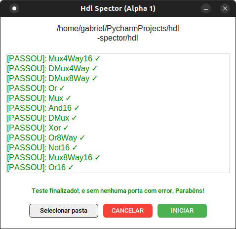
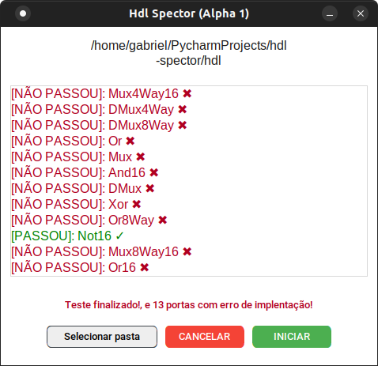

# hdl-spector (Alpha 1)

#### Finalidade do programa e automatizar os  testes de portas lógicas feitas no nand2tetris


##### Install the libraries before starting the application

``` sh 
 pip install tk customkinter
```

#### run program

``` sh 
 python main.py`
```

### Screenhots



